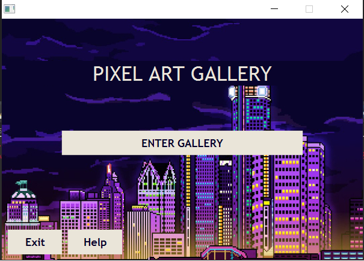
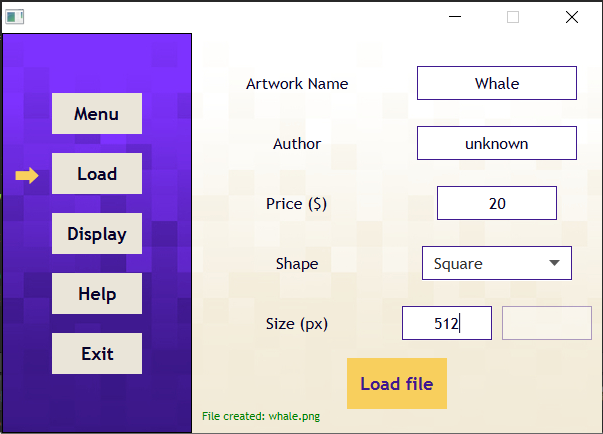
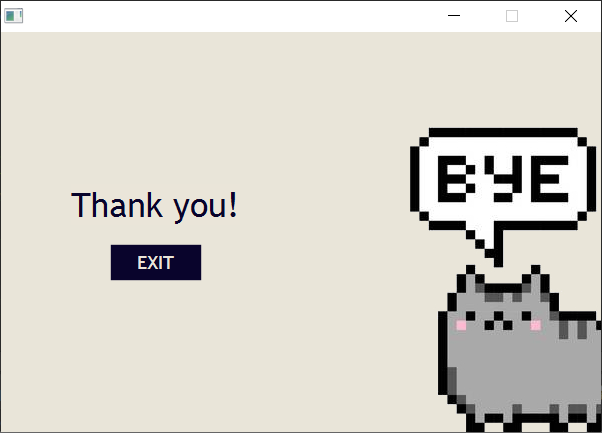

# Pixel Art Gallery  
author: Piotr Ko³odziejski  
course: Java EE - produkcja oprogramowania  
project: Projekt przejœciowy (PRP)  
# RUN
Main class: src/controller/Main.java

# Screenshots 

# Description
Program allows user to:  
* SEARCH for pixel artworks
* FILTER by chosen value
* SORT by chosen property
* EDIT artworks,
* ADD new artworks,
* STORE them in memory
* COMMENT and RATE on artworks.
	
# How to use it
1. Open program and click "Enter gallery".  
1. Sidebar allows you to navigate between pages.
1. Sidebar offers following options:
    1. LOAD -> loading external artwork
    1. EDIT -> editing artworks' information
    1. DISPLAY -> presenting artworks in a table
    1. MENU -> going back to welcome page
    1. EXIT -> closing program
1. On DISPLAY: comment and rate artworks by choosing artwork and clicking "Comment" button.   
1. On EDIT: choose artwork from list and edit artwork properties in given fields
1. On LOAD: click "Load File" to load your image, then provide info in given fields.  
  
Are you lost? Click "Help" on the bottom left corner to see this help page.

# Components
* Menu
    - buttons: Help, Enter gallery, Exit
    - info: author, date, version, course/project info, short functional description
* Display
    - sidebar: [Menu, Help, Display, Load, Exit]
    - help button in bottom-left corner
    - table: contains artwork info (name, author, size, area, price, etc.)
    - button "Display": shows an image
    - button "Comment": enables to read and write comments as well as rate chosen artwork
* Load
    - sidebar: [Menu, Help, Display, Load, Exit]
    - field to load image
    - fields to insert properties (name, author, price etc.)
    - button "Add"
* Comment
    - display all comments for chosen artwork
    - field to add new comment using button "Comment"
    - radio buttons to rate an artwork
* Exit
    - greeting message for user
    - button "Exit"
	
# Navigation
FROM Menu TO [Help, Display, Load, Exit]  
FROM Help TO [Menu, Exit]  
FROM Display TO [Menu, Help, Display, Load, Exit]  
FROM Edit TO [Menu, Help, Display, Load, Exit]  
FROM Load TO [Menu, Help, Display, Load, Exit]  
FROM Exit TO null  
FROM Comment TO [Display]  
# Project Structure
  
* MODEL:
    - class PixelArt - info about artwork (name, author, price, shape, size, comments etc.)
    - class Author - first name, last name
    - class Shape - has info about size (width and height or radius) and shape of artwork (rectangle, square, circle as enum)
    - List<Comment> - list of comments for every artwork
    - class Comment - has String for comment text and Integer for rating
* VIEW: 
    - MenuView.fxml
    - DisplayView.fxml
    - EditView.fxml
    - LoadView.fxml
    - CommentView.fxml
    - style.css
* CONTROLLER:
    - MenuController.java
    - EditController.java
    - LoadController.java
    - CommentController.java
    - DisplayController.java
    - ExitController.java

# Artwork Storage
* data - folder containing all the pictures
* data.dat - file containing information about artworks (name, price, author, size etc.)
# Storage Format
* Artworks in data.dat are stored in a specific format.
* Every line is an artwork.
* All properties are seperated by double hash ## separator
* End of line \n means next artwork. 
* Order of properties is id, file name, name, author, price, shape, size, area, comments
* Shape could have 3 keywords (circle, square, rectangle)
* Size is a single value (for a circle and square) or width@@height expression with @@ as a separator for rectangle
* Comments are text::rating expressions separated by $$ separator
* ATTENTION: file parser will be CASE SENSITIVE
  
Example:  
id##my_mario.jpg##mario##Piotr Kolodziejski##120##rectangle##200@@300##60000##very good::5$$not bad::2
  
# Colors
* dark purple HEX = #09042c, RGB = (9, 4, 44) 
* light purple HEX = #3f1990, RGB = (63, 25, 144)
* crazy yellow HEX = #f8cf5d, RGB = (248, 207, 93)
* eggshell HEX = #EAE5D9, RGB = (234, 229, 217)

